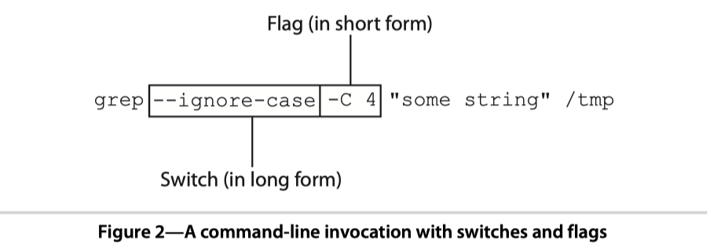

# 02 Be Easy to Use

|本期版本| 上期版本
|:---:|:---:
`Wed Sep  4 15:05:57 CST 2024` | -


## 2.1 Understanding the Command Line: Options, Arguments, and Commands


---

### Options

> Options are the way in which a user modifies the behavior of your app.（用于修改程序的行为）


**Options come in two forms: long and short(两种格式: 简写和完整)**

* `Short-form` options are preceded by **a dash** and are only **one character** long, **can be combined** after a single dash
* `Long-form` options are preceded by **two dashes** and, strictly speaking, consist of **two or more characters**, **cannot be combined**

格式|前缀|字符|合并
---|---|---|---
简写|`-`|一个|可以
完整|`--`|多个|不可以

**Command-line options can be one of two types(两种类型: 开关和标志)**




* `switches`: used to turn options on and off and do not take arguments(用于打开或关闭选项，不需要参数)
* `flags`, which take arguments

---

* switch is in the long-form (for example --foo), which turns **“on”** some behavior, there is also another switch preceded with **no-** (for example --no-foo) that turns “off” the behavior

```bash
--foo			// 打开
--no-foo		// 关闭
```

* `long-form` flags take their argument via an **equal sign**, whereas in the short form of a flag, an equal sign is typically not used

```bash
// 不使用等号
curl -X POST http://www.google.com

// 使用等号
curl --request=POST http://www.google.com
```

---

### Arguments

* arguments represent the objects that the command-line app will operate on
* Not all command-line apps take arguments

---

### Commands


* **command-suite**
* `Global options`: before the command
* `Command options`: follow a command

## 2.2 Building an Easy-to-Use Command-Line Interface


**Building a Command-Line Interface with OptionParser**

* if a string is passed and it **starts with a dash** followed by one or more **nonspace characters**, it’s treated as a **switch**.(`-xx`没有空格的开关)
* If there is a space and another string, it’s treated as a `flag`(`-u xx` 有空格的标志)

**Validating Arguments to Flags**

**classname**

* Integer / `accept`

## 2.3 Building an Easy-to-Use Command-Suite Interface


## Ref

* <https://docs.ruby-lang.org/en/3.2/OptionParser.html>
* <https://github.com/rack/rackup/blob/main/lib/rackup/server.rb>
* <https://github.com/rails/thor>
* [如何区分命令行下的arguments、flags、options?](https://segmentfault.com/q/1010000011077731)